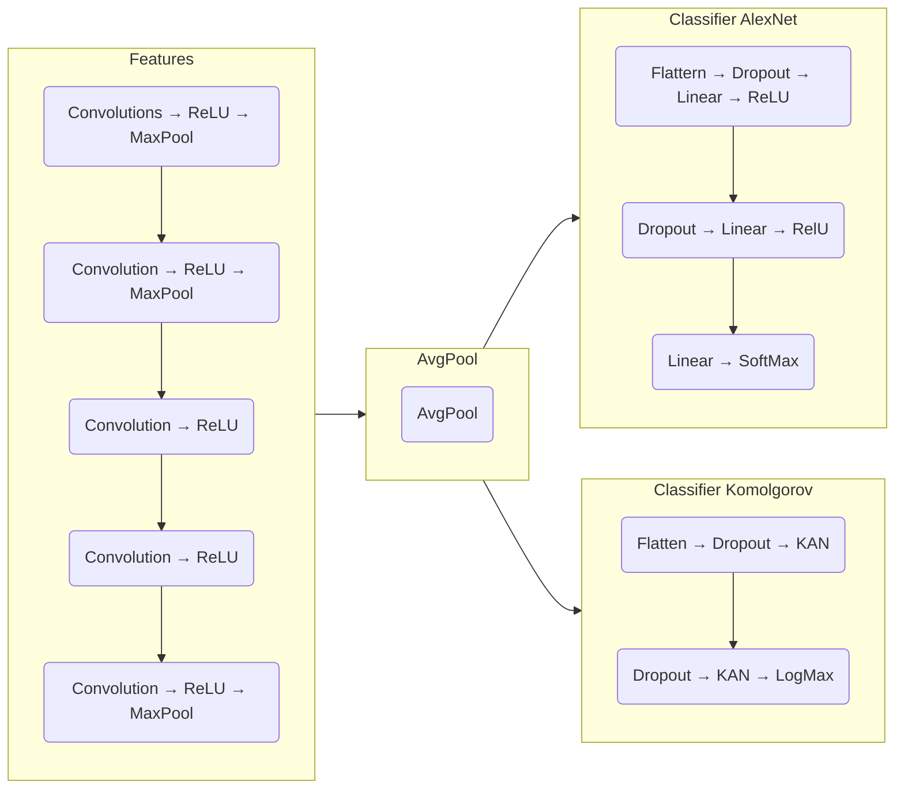

# Exploring Komolgorov-Arnold Network applications in image classification tasks

Tilman de Lanversin - [tilmand](tilmand@g.ecc.u-tokyo.ac.jp)  
ETH MSc student in Computer Science, Major in Visual and Interactive Computing  
Exchange student at the University of Tokyo in Creative Informatics

## Instructions

- Read one paper presented in 2020-2024 at TOP journals/conferences
- Implement them by yourself and submit source code to GitHub (make it open).
  - Authors’ original source code must not be used.
- Add an explanation explaining
  - Why this paper is important (what the technical core is, why the paper is accepted)
  - What you have implemented

## Choice of model

As of early 2024, a new paper has been published to arXiv ([Liu Z. et al.][1]) with a revisiting of an old machine learning network model, the Komolgorov-Arnold Network. This architecture is presented as an alternative to the very commonly used MLP model, and is also a universal approximator.

These models are based on the Komolgorov-Arnold representation theorem, which states that any multivariate continuous function can be represented as "superposition of continuous functions of one variable and addition" ([AN Komolgorov][4]). If we assume that there is a finite solution, we can then model the KA representation theorem as a two layer deep, arbitrarily wide network of univariate continuous functions that are added together and concatenated to output a vector at each step.

Using splines as surrogate continuous functions in this method is not particularly new, but breaking this assumption of two layer is what made this paper innovative. Using modern backpropagation techniques to allow the models to be deepe, and B-splines to have easy parameters to differentiate on has allowed for greater expressiveness and trainability for the models. The authors show a few key interesting bonusses that KAN networks can have over regular MLPs, namely a decreased parameter count, learnable non-linearities, and increased interpretability.

While these were observed on simple testcases, and apply mostly to scientific calculations and are observed to be more useful mostly on deeper laten spaces ([GraphKAN][2]), this finding has a lot of potential.

## Choice of implementation

Taking into consideration these factors, I chose to try and implement the KAN as a step in a bigger image recognition pipeline. This would allow us to make use of it's strengths in later latent spaces, by first calculating all the convolutions before going into the KAN, as well as it's potential in explanability to show image features that the model is looking for.

I then pitched this idea to professor Yamasaki, who approved of it on slack here:

> **Tilman** *12:56*  
>> Hello professor Yamasaki, I'm contacting you with regards to the project for Visual Media. Would you consider implementing a ResNET architecture with a Komolgorov Arnold Network instead of an MLP a sufficient task for the project? I don't believe such a paper has been created, but I think the idea could be interesting to explore in a simple course project like this one. Thank you for your opinion
>
> **Toshihiko Yamasaki (教職員)** *13:20*  
>> I do not know whether it has never been tried before, but it sounds interesting.
> When submitting your report, please paste our conversation or mention that I said yes.
>
> **Tilman** *13:20*  
>> Thank you

## Exploring KANs

### FourierKAN

To start off, for me to have a good basis to compare to, I downloaded a recently created KAN based model by Github user `GistNoesis` ([FourierKAN][3]) that uses fourier series instead of B-splines for the learnable function. This is also in a pytorch layer format, and will thusly allow me to very easily use it as a first implementation.

This implementation leverages fourier to model the function we are learning,which allows for a more global coverage of the function space, but has the tradeoff of being computationally intensive and has some oversampling issues in lower frequencies.

Despite these drawback, I opted for this option as it is ready made and can potentially be reverted to a B-spline approximation once the weights are learned. In the end, I didn't do so, as the main advantage for that is to speed up evaluation of the model and isn't very important in my case.

### CIFAR10 and AlexNet

As a baseline for image classification in this exploration of KANs, I have a few restrictions on the model type I could choose. I want to train on the CIFAR10 dataset, as it is relatively well known, has a small image size, and so can reduce the input size of the model to aleviate weigth on my machine, and is included in the torchvision dataset list.

For that, I need a model that is relatively small, so as to fit on my laptop, contained some fully connected layers that could be replaced with KANs, and has enough performance to make good predictions.

The model that I chose is a modification of the base AlexNet model architecture that first revolutionized computer vision by showing the potential performance of deep neural networks.

### First experiment

#### Architecture

For the first experiment, I chose to take the existing AlexNet, and compare the performance if we replace the classification part of the layer with a KAN based model. As such, this is the architecture I came up with:



```python
features = nn.Sequential(
    # Kernel Sizes, stride, and padding were adjusted on all
    # layers to allow the model to work on the 32x32x3 images
    # of CIFAR10 rather than the original intended 227x227x3
    nn.Conv2d(3, 64, kernel_size=3, stride=1, padding=1),
    nn.ReLU(inplace=True),
    nn.MaxPool2d(kernel_size=2, stride=2),
    nn.Conv2d(64, 192, kernel_size=3, padding=1),
    nn.ReLU(inplace=True),
    nn.MaxPool2d(kernel_size=2, stride=2),
    nn.Conv2d(192, 384, kernel_size=3, padding=1),
    nn.ReLU(inplace=True),
    nn.Conv2d(384, 256, kernel_size=3, padding=1),
    nn.ReLU(inplace=True),
    nn.Conv2d(256, 256, kernel_size=3, padding=1),
    nn.ReLU(inplace=True),
    nn.MaxPool2d(kernel_size=2, stride=2)
)
avgpool = nn.AdaptiveAvgPool2d((4, 4))
classifier_AlexNet = nn.Sequential(
    nn.Flatten(),
    nn.Dropout(),
    nn.Linear(256 * 4 * 4, 4096),
    nn.ReLU(inplace=True),
    nn.Dropout(),
    nn.Linear(4096, 4096),
    nn.ReLU(inplace=True),
    nn.Linear(4096, 10),
    nn.LogSoftmax(dim=1)
)
classifier_KAN = nn.Sequential(
    nn.Flatten(),
    nn.Dropout(),
    NaiveFourierKANLayer(256 * 4 * 4, 100, gridsize=7, smooth_initialization=True),
    nn.Dropout(),
    NaiveFourierKANLayer(100, 10, gridsize=5, smooth_initialization=True),
    nn.LogSoftmax(dim=1)
)
```

An already interesting fact to notice is the size of the models. We can see from the number of parameters that the KAN model is almost 5 times smaller than the pure AlexNet model.

``` python
35_855_178 =: AlexNet parameters
 7_996_094 =: KAN parameters

33_603_594 =: AlexNet classifier parameters
 5_744_510 =: KAN classifier parameters

 2_251_584 =: features parameters
```

### Results

Training times on my laptop were very large, but I was able to train the AlexNet model on the ETH Zurich computer cluster, and it took around 2h30 (I lost the exact time).

The Fourier Kan model was much harder to get running, so I ended up training it on my laptop where it took 5h. On top of that, to save on training time, and because I wanted to compare only the classifiers, I re-used the feature convolution network of the trained AlexNet model to initialize the KAN model.

The final classification results ended up being:

#### AlexNet
``` python
Accuracy of the network on the 10000 test images: 79.92%
Accuracy of plane: 82.2%
Accuracy of car: 84.3%
Accuracy of bird: 75.3%
Accuracy of cat: 60.1%
Accuracy of deer: 75.3%
Accuracy of dog: 70.3%
Accuracy of frog: 89.2%
Accuracy of horse: 85.8%
Accuracy of ship: 88.1%
Accuracy of truck: 91.2%
```

#### KAN model
```python
Accuracy of the network on the 10000 test images: 81.85%
Accuracy of plane: 87.1%
Accuracy of car: 90.1%
Accuracy of bird: 67.8%
Accuracy of cat: 65.4%
Accuracy of deer: 86.7%
Accuracy of dog: 71.8%
Accuracy of frog: 85.8%
Accuracy of horse: 81.0%
Accuracy of ship: 88.5%
Accuracy of truck: 87.8%
```

These results show a lot of promise for the KAN model, and shows that we can already compact a model greately without impacting performance. There is definitely an investigation path available to see if we can downsize the AlexNet model already without the KAN, as we might simply be dealing with a model that is too big for the dataset. A real test of performance could be made by modifying the original AlexNet and training on ImageNet, but that would require a lot of compute, performance optimization, and is out of scope for this project.

### Second experiment

My second idea of a KAN inspired machine vision task is to transform a comvolution layer into a KAN powered layer.

---

[1]: <https://arxiv.org/abs/2404.19756> "Liu, Z., Wang, Y., Vaidya, S., Ruehle, F., Halverson, J., Soljačić, M., Hou, T.Y. and Tegmark, M., 2024. Kan: Kolmogorov-arnold networks. arXiv preprint arXiv:2404.19756."

[2]: <https://github.com/WillHua127/GraphKAN-Graph-Kolmogorov-Arnold-Networks?tab=readme-ov-file> "GraphKAN -- Implementation of Graph Neural Network version of Kolmogorov Arnold Networks (GraphKAN)"

[3]: <https://github.com/GistNoesis/FourierKAN?tab=readme-ov-file> "FourierKAN -- Pytorch Layer for FourierKAN"

[4]: <https://www.mathnet.ru/php/archive.phtml?wshow=paper&jrnid=dan&paperid=22050&option_lang=eng> "Kolmogorov AN. On the representation of continuous functions of many variables by superposition of continuous functions of one variable and addition. InDoklady Akademii Nauk 1957 (Vol. 114, No. 5, pp. 953-956). Russian Academy of Sciences."
